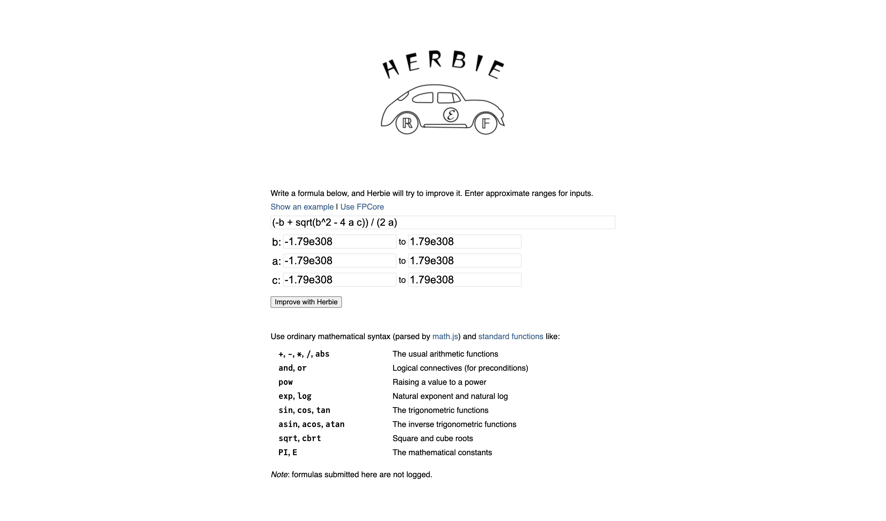
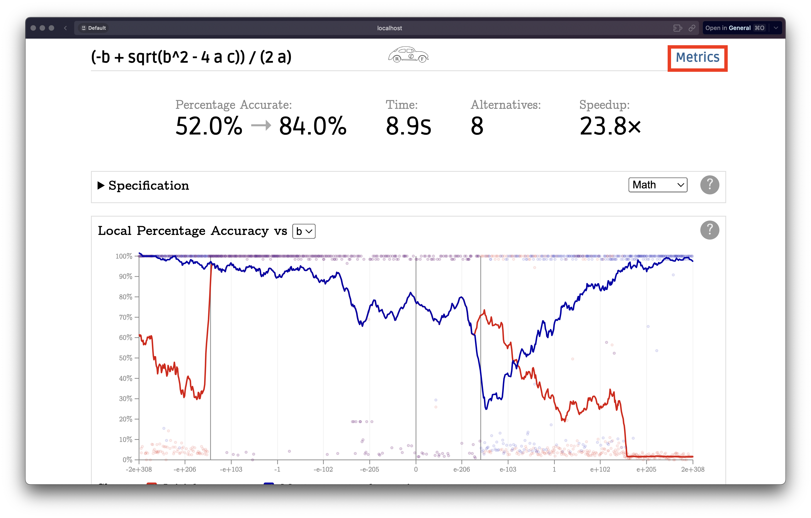
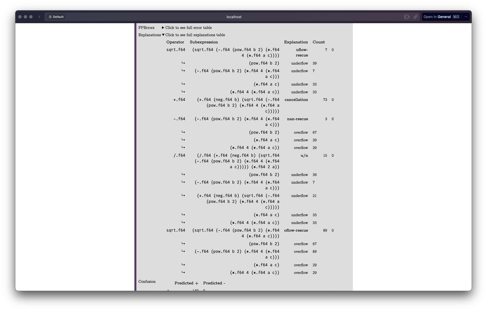

# Finding and Explaining Errors in Floating Point programs

## Installing

This project requires Racket 8.0 or later,
  Rust 1.60.0 or later, and supports Windows, macOS, and Linux
  for various architectures.

Install Racket from [here](https://download.racket-lang.org/). We recommend 
the official Racket installer over Snap. If your configuration depends on Racket 
being installed via Snap, you will need to ensure that Herbie and all packages are 
located in your home directory or another allow-listed directory.
Install Rust from [here](https://www.rust-lang.org/tools/install).
In this directory, build Herbie with:

    make install

## Running the project

To run this project you can run the command:

    racket src/herbie.rkt web

This will open Herbie's web interface. Here you will be prompted to enter the floating point expression whose error's you want explained, along with ranges for each input variable.

After Herbie is done improving the expression for accuracy, Herbie directs you to a report page showing optimized rewrites of the expression. To get explanations, you will have to click the "metrics" link at the top right corner of the report page. 

This will take you the metrics page. Under the section "preprocess", you should find a dropdown called "Explanations". The explanations of the errors of the expression will be found here. Each explanation shows the erroneous operator, erroneous subexpression, the explanation and the frequency of the error. In sub-expressions where the cause of error is an over/underflow, possible sources of over/underflow are also listed.

If you want to run explanations on one of Herbie's benchmark suites, you can run

    racket src/herbie.rkt bench/hamming report/ 

Herbie will run for all the expressions in the benchmark and the collected report will be in the folder `report`.

## Source Code of the project

You will find the main explanations algorithm in the function `predicted-errors` starting at line 50 in the file [`src/error-table.rkt`](src/error-table.rkt).

    racket src/herbie report bench/ report/
    
